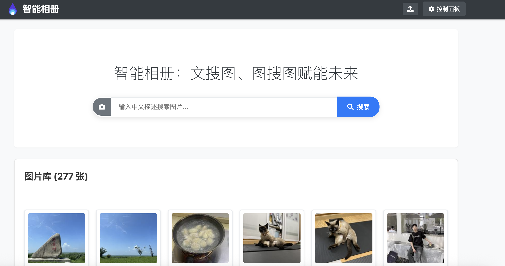

# 智能相册 (Smart Album)

本项目是一个功能完备、基于 Flask 的智能相册 Web 应用，专为在 **Sophgo TPU** 硬件上高效运行而设计。它允许用户上传图片，并通过两种强大的方式进行智能检索：**中文文本描述搜图**和**以图搜图**。

系统深度整合了硬件加速的 AI 模型，利用 **Chinese-CLIP** 生成高质量的图文特征向量，**BCE (BERT-based Chinese Embedding)** 模型增强文本理解能力，并通过 **FAISS** 实现海量数据的毫秒级向量检索。此外，项目还集成了 **Qwen-VL** 大语言模型的云服务，能够对图片进行深入分析，自动生成详细的描述和精准的关键词，从而极大地提升了“增强搜索”模式下的检索精度和用户体验。所有图片元数据和 AI 分析结果都通过 **SQLite3** 数据库进行持久化存储和管理。

## ✨ 功能特点 (Features)

* **图片上传与管理 (Image Upload & Management)**:
  * 支持单张或批量图片上传。
  * 自动为上传的图片生成缩略图，优化加载速度。
  * 支持对单张或多选图片进行永久删除。
  * 支持为单张或多选图片批量添加自定义标签。

* **智能搜索 (Intelligent Search)**:
  * **文本搜图**: 输入中文自然语言描述，系统能理解语义并找出最相关的图片。
  * **图像搜图**: 上传一张图片作为查询，系统会找出图片库中所有视觉上相似的图片。
  * **增强搜索**: 可在控制面板中开启/关闭的混合检索模式。开启后，搜索时会融合图片的视觉特征（CLIP）和其AI生成描述的文本特征（BCE），提供更精准、更符合人类直觉的搜索结果。

* **AI图片分析 (AI-Powered Analysis)**:
  * 通过集成 **Qwen-VL** 模型，可在图片上传时自动或在之后手动为图片生成详细的中文描述和关键词标签。
  * AI分析结果不仅方便用户理解图片内容，还会被“增强搜索”模式利用以提升检索质量。

* **用户界面 (User Interface)**:
  * **主页**: 简洁的界面，集成了文本和图像搜索功能，并以无限滚动的瀑布流形式展示整个图片库。
  * **控制面板**: 提供一个独立的页面，用于管理应用的核心设置，如是否自动进行AI分析、是否启用增强搜索等。
  * **图片详情**: 双击任意图片可打开一个模态框，清晰展示高清大图、文件名、AI生成的描述与关键词、用户自定义标签以及搜索时的相似度分数。
  * **批量操作**: 用户可以方便地点击选择多张图片，导航栏上会动态显示“删除选中”和“标记选中”按钮，以进行高效的批量管理。

## 🛠️ 技术栈 (Technology Stack)

* **后端 (Backend)**: Python, Flask
* **AI 模型 (AI Models)**:
  * **图文特征提取 (Image-Text Features)**: **Chinese-CLIP (ViT-H-14)**，使用为 Sophgo TPU 优化的 `.bmodel` 格式，通过 `sophon.sail` API 进行硬件加速推理。
  * **文本向量化 (Text Vectorization)**: **BCE (BERT-based Chinese Embedding)** 模型 (`shibing624/text2vec-base-chinese`)，同样使用 `.bmodel` 格式在 TPU 上运行。
  * **图片视觉语言分析 (Vision-Language Analysis)**: **Qwen-VL**，通过 `qwen_service.py` 调用云端 API 实现。
* **向量数据库 (Vector Database)**: FAISS (CPU版本)
* **元数据数据库 (Metadata DB)**: SQLite3
* **前端 (Frontend)**: 原生 HTML, CSS, JavaScript

## 📋 项目结构 (Project Structure)

```
smart-album-tpu/
├── app.py                     # 主 Flask 应用，包含所有API路由和核心逻辑
├── bce_embedding/             # BCE 文本向量化模块 (基于sophon.sail)
│   ├── __init__.py
│   └── bce_embedding.py
├── clip/                      # Chinese-CLIP 图文特征提取模块 (基于sophon.sail)
│   ├── __init__.py
│   ├── clip.py
│   └── ...
├── database_utils.py          # SQLite3 数据库辅助函数
├── faiss_utils.py             # FAISS 向量索引管理
├── qwen_service.py            # Qwen-VL 图片分析服务 (调用云API)
├── requirements.txt           # Python 依赖包
├── static/                    # 前端静态文件 (CSS, JS, images)
├── templates/                 # HTML 模板 (index.html, controls.html)
├── models/                    # 存放编译好的 .bmodel 文件和 tokenizer 配置
│   ├── BM1684X/               # 1684X模型目录
│   │   ├── cn_clip_image_vit_h_14_bm1684x_f16_1b.bmodel
│   │   ├── cn_clip_text_vit_h_14_bm1684x_f16_1b.bmodel
│   │   └── text2vec_base_chinese_bm1684x_f16_1b.bmodel
│   ├── BM1688/               # 1688模型目录
│   │   ├── text2vec_base_chinese_bm1688_f16_1b_2core.bmodel
│   │   ├── cn_clip_image_vit_h_14_bm1688_f16_1b_2core.bmodel
│   │   ├── cn_clip_text_vit_h_14_bm1688_f16_1b_2core.bmodel
│   │   ├── text2vec_base_chinese_bm1688_f16_1b.bmodel
│   │   ├── cn_clip_image_vit_h_14_bm1688_f16_1b.bmodel
│   │   └── cn_clip_text_vit_h_14_bm1688_f16_1b.bmodel
│   └── shibing624/            # Tokenizer 配置文件目录
├── data/                      # 运行时生成的数据文件
│   ├── smart_album.db         # SQLite 数据库文件
│   ├── album_faiss.index      # FAISS 索引文件
│   └── app_config.json        # 应用配置文件
├── uploads/                   # 用户上传的原始图片 (运行时创建)
└── thumbnails/                # 生成的缩略图 (运行时创建)
```

## 🚀 环境准备与运行

### 1. 硬件与软件环境
* **硬件**: 本项目专为 **Sophgo TPU** (支持BM1684X,BM1688系列) 设计，其性能依赖于 TPU 的硬件加速能力。
* **Python**: 建议使用 Python 3.10 或更高版本。
* **Sophon SDK**: 请确保您已在您的硬件平台上正确安装了 Sophgo SDK，并配置好了 `sophon.sail` Python 库的运行环境。

### 2. 安装依赖
克隆项目后，建议在 Python 虚拟环境中安装所有必需的依赖包。

因项目的环境需求，需要在python3.10及以上版本运行，所以首先安装python3.10
```bash
# 创建并安装python3.10的环境
✅ 步骤 1：安装依赖并添加 Python PPA
sudo apt update
sudo apt install -y software-properties-common
sudo add-apt-repository -y ppa:deadsnakes/ppa
sudo apt update
✅ 步骤 2：安装 Python 3.10

sudo apt install -y python3.10 python3.10-venv python3.10-dev python3.10-distutils
✅ 步骤 3：设置 Python 3.10 为默认 python3 和 python
添加到 update-alternatives

sudo update-alternatives --install /usr/bin/python3 python3 /usr/bin/python3.8 1
sudo update-alternatives --install /usr/bin/python3 python3 /usr/bin/python3.10 2

sudo update-alternatives --install /usr/bin/python python /usr/bin/python3.8 1
sudo update-alternatives --install /usr/bin/python python /usr/bin/python3.10 2
可选：手动切换默认版本

sudo update-alternatives --config python3
sudo update-alternatives --config python
系统会提示选择编号，选择对应 Python 3.10 的编号即可。

✅ 步骤 4：确认默认 Python 版本

python --version
python3 --version
输出应类似于：


Python 3.10.x
✅ 步骤 5：安装 pip（如未自动安装）
如报错 No module named pip，可运行：


python3.10 -m ensurepip --upgrade
python3.10 -m pip install --upgrade pip
创建 pip 的软链接（可选）

sudo ln -s /usr/bin/pip3 /usr/local/bin/pip
```

安装需要的依赖
```
# 安装依赖
pip install -r requirements.txt
sudo apt install -y libgl1
python -m dfss --install sail
```

### 3. 模型文件准备
* 本项目需要使用为 Sophgo TPU 编译的 `.bmodel` 文件。请将您的 `cn_clip` (image 和 text) 和 `bce` 模型的 `.bmodel` 文件放置在 `models/BM1684X/` 目录下（或根据您的硬件修改 `app.py` 中的启动参数路径）。
* 确保 `models/shibing624/text2vec-base-chinese` 目录中包含 BCE 模型所需的 `tokenizer` 相关配置文件。
如果您还没下载，可以使用下面的脚本下载
```
cd scripts
./download_bmodel.sh BM1684X # 或者BM1688
```

### 4. Qwen-VL API 配置
* 打开 `qwen_service.py` 文件。
* 在文件顶部找到并修改 `QWEN_API_KEY` 和 `QWEN_BASE_URL` 为您的 Qwen-VL 服务凭证。
* **安全提示**: 强烈建议通过环境变量 (`export QWEN_API_KEY="your_key"`) 来设置 API 密钥，而不是直接硬编码在代码中。

### 5. 运行项目
在项目根目录下，使用以下命令启动后端服务。您必须通过命令行参数指定模型文件的路径和要使用的 TPU 设备 ID。
```bash
python app.py \
  --image_model './models/BM1684X/cn_clip_image_vit_h_14_bm1684x_f16_1b.bmodel' \
  --text_model './models/BM1684X/cn_clip_text_vit_h_14_bm1684x_f16_1b.bmodel' \
  --bce_model './models/BM1684X/text2vec_base_chinese_bm1684x_f16_1b.bmodel' \
  --dev_id 0
```
* `--dev_id`: 指定要使用的 TPU 设备 ID (例如，0, 1, ...)。

服务默认会在 `http://0.0.0.0:5000` 启动。在浏览器中打开 `http://localhost:5000` 即可开始使用。

---
前端交互界面如下：

